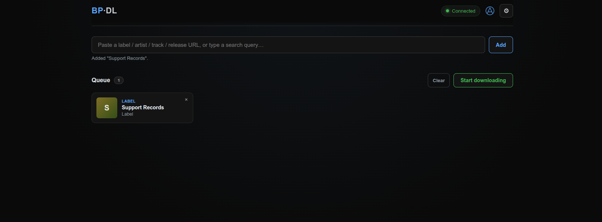
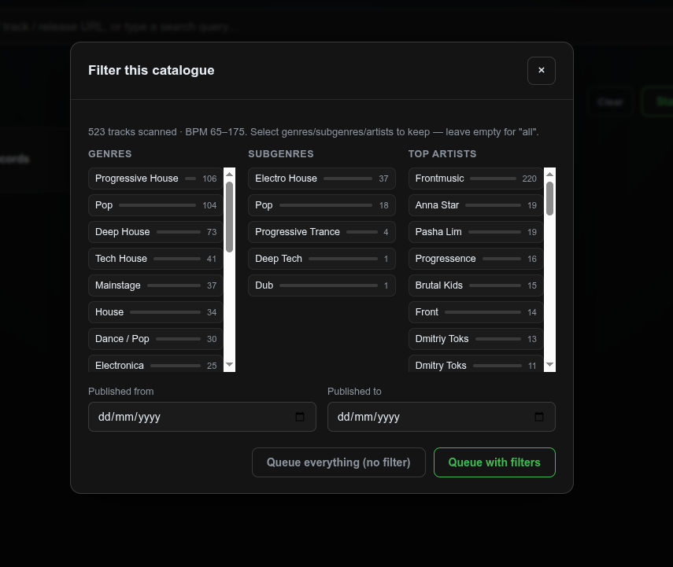
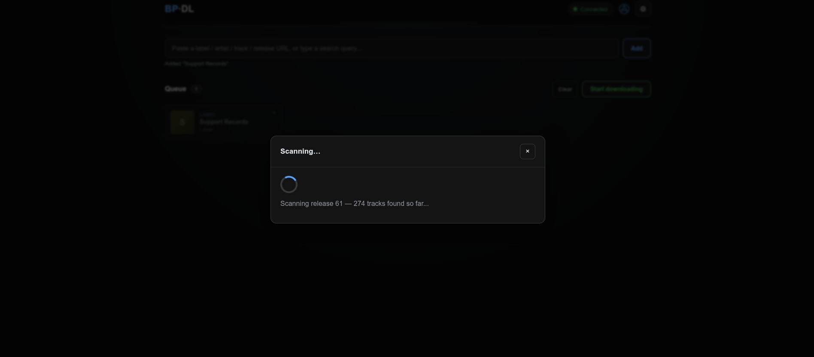
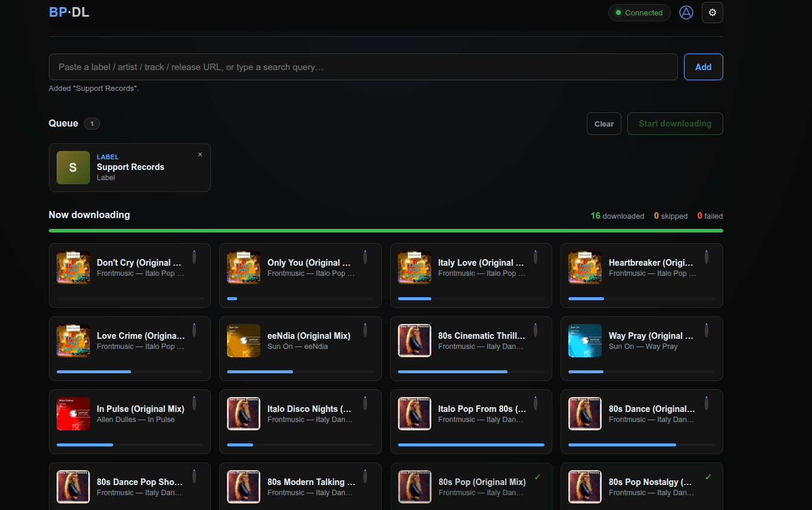

# beatportdl-webui

A from-scratch Python rewrite of BeatportDL — no Go, no CGO, no compiled TagLib/ffmpeg
toolchain. Same core capability (Beatport/Beatsource downloader with label/artist filtering),
delivered as a **web UI** (FastAPI + server-sent events) reachable from any browser on your
network: live per-track progress bars, real album art, a genre/subgenre/artist filter wizard,
full settings control, and an installable "app icon" via its web manifest.

Runs on Linux (amd64/arm64), Windows, and macOS. Docker images are multi-arch
(`linux/amd64` + `linux/arm64`).

## Screenshots

| Queue | Filter wizard |
|---|---|
|  |  |

| Scanning a label | Live downloads |
|---|---|
|  |  |

## What changed vs. the original Go version

- **One web UI, no terminal wizard.** Everything — login, settings, queueing, filtering,
  downloading — happens in the browser. Nothing to SSH in for.
- **Live progress everywhere** — scanning a label/artist streams status in real time; real
  byte-level progress bars per track as they download, with a running
  downloaded/skipped/failed stats bar.
- **"Queue everything, no filter"** — skip genre/subgenre/artist/date filtering entirely and
  queue the whole label/artist catalogue unfiltered, right from the filter wizard.
- **Full settings control in the browser**, not just a config file — account, downloads,
  folder/file naming templates, and tagging, all writing straight back to the YAML config.
  First run prompts for the required fields before unlocking anything else.
- **Album/track art recheck** — a library-maintenance tool (Settings → Library maintenance)
  that walks your downloads folder, finds tracks with missing or broken embedded artwork, and
  re-fetches + re-embeds it from Beatport/Beatsource using the release ID now embedded in every
  download's tags (`BEATPORT_RELEASE_ID` / `BEATPORT_TRACK_ID`).
- **No C++ build chain.** Tagging is `mutagen` (FLAC Vorbis comments + real MP4 atoms), not a
  vendored TagLib. No ffmpeg dependency — the AAC-via-HLS quality path from the original tool
  was dropped since this setup is FLAC-first (AAC 128/256kbps still available as quality
  options, served directly by Beatport's API with no local transcoding).
- **Bulletproof-er downloads** — atomic writes (`.part` file + rename), retry with backoff on
  flaky network calls, and a run summary (downloaded/skipped/failed) at the end.
- **Same skip logic** as the original: pre-release, territory-restricted, and generically
  unavailable (403/404) tracks are silently skipped and logged, both during download and during
  label scanning (a territory-restricted release doesn't abort the whole scan).
- **Windows build restored** — a standalone `bpdl-web.exe`, built via PyInstaller in CI on every
  release, no Python install required.

## Quick start — Docker (recommended)

Pull the multi-arch image (works on amd64 and arm64 hosts — Raspberry Pi, Apple Silicon, etc.
— without any extra flags):

```bash
docker pull ghcr.io/bertonumber1/beatportdl-webui:latest
```

Or build locally:

```bash
docker compose build
docker compose up -d bpdl-web   # persistent, http://<host>:8095
```

`compose.yml` routes it through a `gluetun` VPN container (`network_mode: container:gluetun`)
matching the original Go build's networking — drop that line if you don't use a VPN container.
Config lives in `./config/bpdl-config.yml` (created on first run/first save); downloads land
wherever the `/downloads` volume mount points — edit that in `compose.yml` to match your setup.

Once it's running, open `http://<host>:8095` in a browser — that's the entire interface. For a
one-tap launcher, use your browser's "Add to Home Screen" (mobile) or "Install app" (desktop
Chrome/Edge) — the web manifest gives it a real icon.

### Building/publishing a multi-arch image yourself

```bash
docker buildx create --name multiarch --driver docker-container --use
docker buildx build --platform linux/amd64,linux/arm64 -t you/beatportdl-webui:latest --push .
```

## Quick start — native Linux / macOS (no Docker)

Works on amd64 and arm64 (Apple Silicon) — every dependency ships proper wheels for both.

```bash
pip install .
bpdl-web    # web UI on :8095
```

## Quick start — Windows

**Option A — standalone .exe, no Python required:** download
`beatportdl-webui-windows-x64.zip` from the
[Releases page](https://github.com/bertonumber1/beatportdl/releases), unzip, run
`bpdl-web.exe`, then open `http://localhost:8095`.

**Option B — pip, if you already have Python 3.10+:**

```powershell
pip install .
bpdl-web
```

### Building the Windows .exe yourself

```powershell
pip install . pyinstaller
pyinstaller --onefile --name bpdl-web --collect-all fastapi --collect-all starlette --collect-all uvicorn --add-data "bpdl/webui/static;bpdl/webui/static" scripts\win_bpdl_web.py
```

The `.exe` lands in `dist\`. This is exactly what `.github/workflows/release.yml` runs on every
tagged release.

The web server's port defaults to `8095`; override with the `BPDL_WEB_PORT` environment
variable if you need it elsewhere.

## Using it

1. Open `http://<host>:8095`. First run prompts for username/password/downloads directory —
   nothing else is reachable until those are set.
2. Paste a **label/artist URL** → live scan progress → a chip-based genre/subgenre/artist/date
   filter picker (bar length = relative track count) → "Queue with filters" or "Queue
   everything (no filter)".
3. Paste a **track/release/playlist/chart URL** → added straight to the queue with its cover
   art.
4. Type a **search query** (optionally `@beatsource daft punk`) → pick results from a grid,
   add selected.
5. **Start downloading** → live cards per track with real progress bars, a running
   downloaded/skipped/failed stats bar, toasts on completion.
6. Gear icon → **Settings** any time (all fields, plus the album/track art recheck tool under
   "Library maintenance").

## Config reference

Everything under `config/bpdl-config.yml` is editable via the Settings screen, with one
exception: `tag_mappings` (which controls exactly which Vorbis/MP4 tag each metadata field maps
to) isn't exposed there — hand-edit the YAML if you need to change it from the built-in
defaults.

All three quality tiers from the original tool are supported — `lossless` (FLAC), `high` (AAC
256kbps), `medium` (AAC 128kbps) — served directly by Beatport/Beatsource's API, no ffmpeg or
local transcoding involved.
