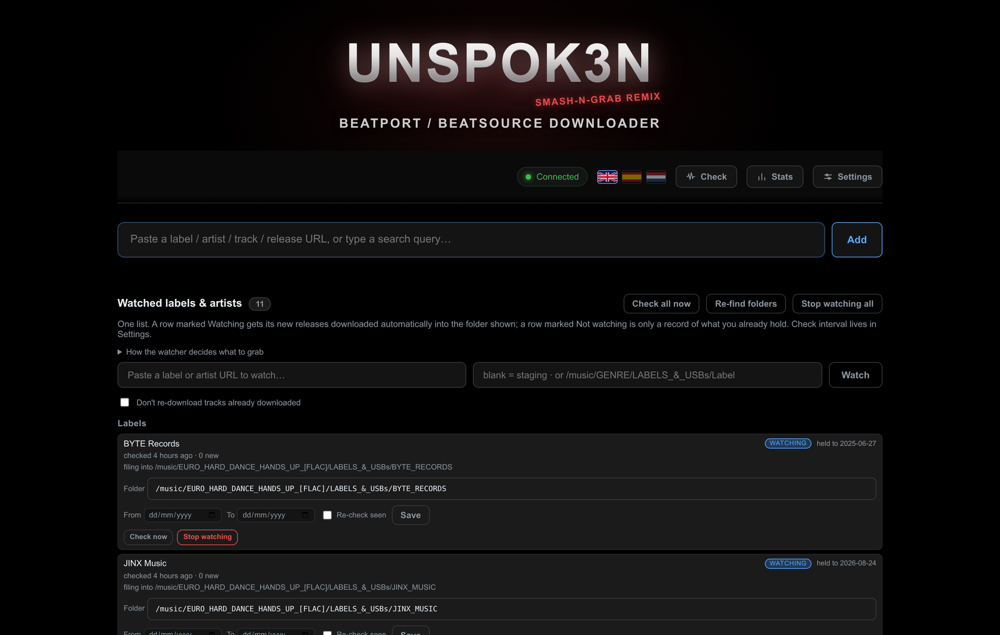
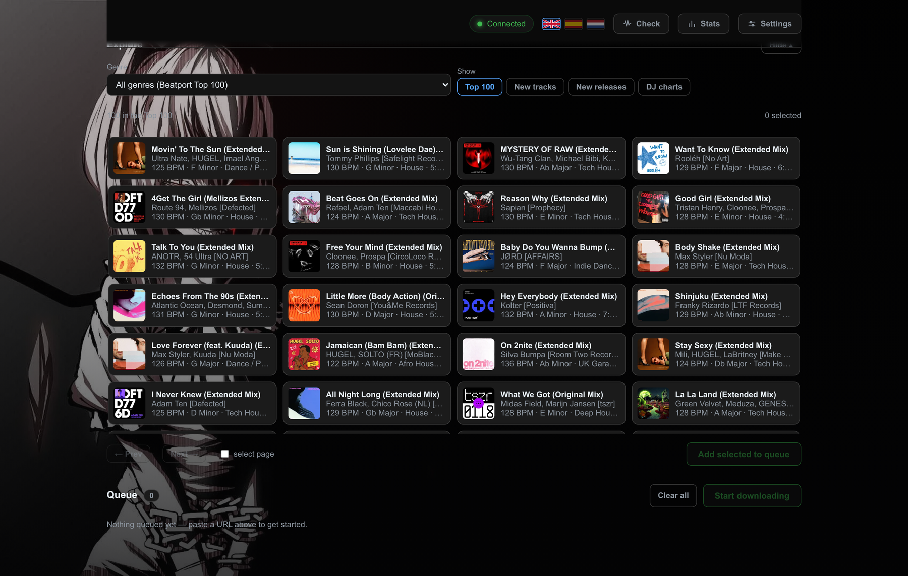
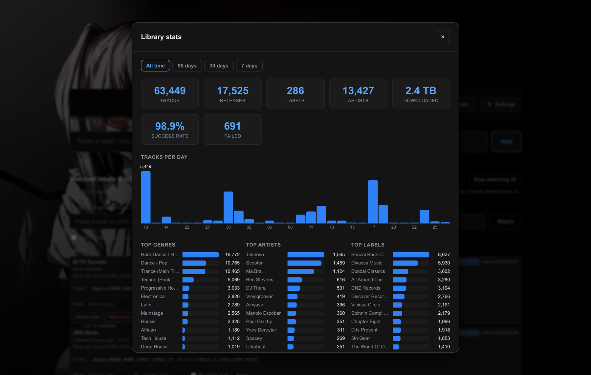
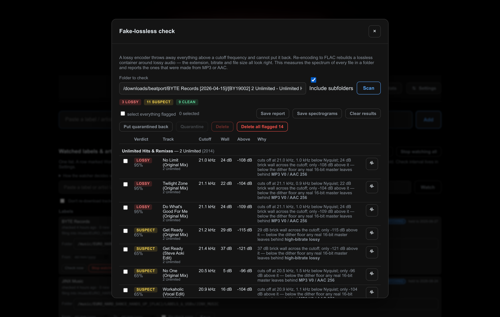
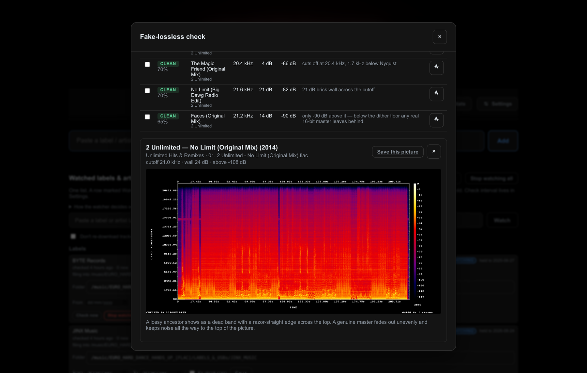

# beatportdl-webui

A from-scratch Python rewrite of [BeatportDL](https://github.com/unspok3n/beatportdl) (original
Go version by [unspok3n](https://github.com/unspok3n)) — no Go, no CGO, no compiled
TagLib/ffmpeg toolchain. A Beatport/Beatsource downloader with label/artist filtering,
delivered as a **web UI** (FastAPI + server-sent events) reachable from any browser on your
network: live per-track progress bars, real album art, a genre/subgenre/artist filter wizard,
full settings control, and an installable "app icon" via its web manifest. It also ships a
**fake-lossless checker** — point it at a folder and it finds the FLACs that were really made
from an MP3 or an AAC, with a spectrogram for every track.

Runs on Linux (amd64/arm64), Windows, and macOS. Docker images are multi-arch
(`linux/amd64` + `linux/arm64`).

## Screenshots

**Home — paste a label / artist / track / release URL, and watch labels or artists for new releases**



**Explore — browse the Beatport Top 100, new tracks, new releases and DJ charts, and queue straight from the charts**



**Library stats — tracks, releases, success rate and downloads per day**



**Fake-lossless check — scan a folder and find the FLACs that were really made from an MP3 or an AAC**



**A spectrogram for every track — the wall at 21 kHz is an encoder's, not a mastering engineer's**



## Quick start — Docker (recommended)

Pull the multi-arch image (works on amd64 and arm64 hosts — Raspberry Pi, Apple Silicon, etc. —
without any extra flags):

```bash
docker pull ghcr.io/bertonumber1/beatportdl-webui:latest
```

Or build locally:

```bash
docker compose build
docker compose up -d bpdl-web   # persistent, http://<host>:8095
```

`compose.yml` routes it through a `gluetun` VPN container (`network_mode: container:gluetun`) —
drop that line if you don't use a VPN container. Config lives in `./config/bpdl-config.yml`
(created on first run/first save); downloads land wherever the `/downloads` volume mount
points — edit that in `compose.yml` to match your setup.

Once it's running, open `http://<host>:8095` — that's the entire interface. For a one-tap
launcher, use your browser's "Add to Home Screen" (mobile) or "Install app" (desktop
Chrome/Edge); the web manifest gives it a real icon.

<details>
<summary>Building/publishing a multi-arch image yourself</summary>

```bash
docker buildx create --name multiarch --driver docker-container --use
docker buildx build --platform linux/amd64,linux/arm64 -t you/beatportdl-webui:latest --push .
```
</details>

## Quick start — native Linux / macOS (no Docker)

Works on amd64 and arm64 (Apple Silicon) — every dependency ships proper wheels for both.

```bash
pip install .
bpdl-web    # web UI on :8095
```

## Quick start — Windows

**Standalone `.exe`, no Python required:** download `beatportdl-webui-windows-x64.zip` from the
[Releases page](https://github.com/bertonumber1/beatportdl/releases), unzip, run
`bpdl-web.exe`, then open `http://localhost:8095`. The `.exe` is self-contained — it carries
its own ffmpeg, so the fake-lossless checker works with nothing else installed.

Or, with Python 3.10+ already installed:

```powershell
pip install .
bpdl-web
```

<details>
<summary>Building the Windows .exe yourself</summary>

```powershell
pip install . pyinstaller
pyinstaller --onefile --name bpdl-web --collect-all fastapi --collect-all starlette --collect-all uvicorn --collect-all numpy --add-data "bpdl/webui/static;bpdl/webui/static" scripts\win_bpdl_web.py
```

The `.exe` lands in `dist\`. This is exactly what `.github/workflows/release.yml` runs on every
tagged release.
</details>

The web server's port defaults to `8095`; override with the `BPDL_WEB_PORT` environment
variable if you need it elsewhere.

## Using it

1. Open `http://<host>:8095`. First run prompts for username/password/downloads directory —
   nothing else is reachable until those are set.
2. Paste a **label/artist URL** → live scan progress → a chip-based genre/subgenre/artist/date
   filter picker (bar length = relative track count) → "Queue with filters" or "Queue
   everything (no filter)".
3. Paste a **track/release/playlist/chart URL** → added straight to the queue with its cover
   art.
4. Type a **search query** (optionally `@beatsource daft punk`) → pick results from a grid, add
   selected.
5. **Start downloading** → live cards per track with real progress bars, a running
   downloaded/skipped/failed stats bar, toasts on completion.
6. Gear icon → **Settings**, any time — every field, plus the album/track art recheck tool under
   "Library maintenance".
7. **Check** in the top bar → the **fake-lossless checker**. Give it a folder, press Scan, and
   every lossless-claiming file in it is measured and given a verdict. See below.
8. **Language** — the flags in the top bar switch the whole UI between English, Spanish and
   Dutch. The choice is remembered in the browser; with none saved, the browser's own language
   is used and anything else falls back to English.

### Fake-lossless check

A lossy encoder throws away everything above a cutoff frequency and cannot put it back.
Re-encoding the result to FLAC rebuilds a lossless *container* around permanently lossy audio —
the extension, the bitrate and the file size all look right, and only the spectrum still knows.

Point **Check** at a folder and every file in it gets a long-term average spectrum (16384-point
Hann FFT, 50% overlap, digital silence skipped, normalised to the loudest bin), reported as
three numbers: the **cutoff**, how sharply energy falls across it (**wall**), and how much is
left **above** it.

| verdict | meaning |
|---|---|
| `lossy` | cutoff well below Nyquist **and** a brick wall at it **and** a dead band above it |
| `suspect` | one or two of those three, but not all — worth a look |
| `padded` | 24-bit declared, but only 16 bits are ever used |
| `upsampled` | high sample rate with nothing up there to justify it |
| `lossy format` | AAC in an `.m4a` — meant to be lossy, so not a fake |
| `clean` | full spectrum with a live noise floor above it |

A mastering engineer can produce any one of the three signs on their own, which is why `lossy`
needs all three together and one alone only earns `suspect`.

Results are grouped by release with artist, album and year from the tags, and every track has a
spectrogram one click away. Findings can be **quarantined** — an instant move within the same
filesystem, with a restore log, so nothing is destroyed to look at it later — or deleted
outright. Both refuse any path that was not in the last scan. There is also a text report and a
bulk spectrogram export.

Decoding needs **ffmpeg**. The Windows `.exe` carries its own, the Docker image installs one,
and a source install pulls in `imageio-ffmpeg`. To use your own build instead, put `ffmpeg` next
to the program or set `BPDL_FFMPEG` to its full path.

### Adding a language

`bpdl/webui/static/i18n.js` holds one dictionary per language. Copy the `en` block, translate
the values, add a flag SVG to `LANG_FLAGS` — the switcher builds itself from the keys of `I18N`,
so nothing else needs touching. `tests/test_i18n.py` then enforces that the new language defines
exactly the English key set, keeps every `{placeholder}` intact, and leaves no string
untranslated.

### The watch list

One panel, one list, one set of words. Every label and artist bpdl knows about appears as a
row with a state:

* **Watching** — its new releases are downloaded automatically on the interval in Settings,
  into the folder shown on the row.
* **Not watching** — the label is on disk and recorded as held to a date, but nothing
  automatic happens to it. Start watching it, or check it once by hand.

The two dates a row can show are different claims and are worded differently on purpose:
*held to <date>* means the catalogue is on disk up to that Beatport publish date (a full
download was recorded), while *looked as far as <date>* only means the watcher has looked
that far. Only the first is a statement about your files.

### Watching a label, and following its folder

A label you download in full starts being watched straight away, and its folder is marked so
the watcher can find it again after you file it.

* **Auto-watch.** When a label is queued unfiltered ("queue everything") and every track
  succeeds, the whole catalogue is recorded as held, the label joins the watch list, and its
  mark is seeded with what was just taken — so the first scheduled check is an incremental
  top-up, not a re-walk of the entire catalogue. Turn it off in Settings → *Watch a label
  automatically once its whole catalogue is downloaded*; the *Already downloaded in full*
  panel still offers a Watch button per label.
* **Folder marker.** At the same moment, a small hidden `.bpdl-label.json` is written inside
  the folder the download landed in. It names the label and nothing else. Move that folder
  into your library, rename it, put it on another disk — the marker travels with the contents,
  and the next check finds the folder again and updates the watch entry to point at its new
  home. Delete the file and the folder simply stops being followed.
* **Why a marker and not the folder name.** A rename defeats name matching outright, and a
  real library has the same label filed under two genres. A wrong guess writes a download into
  another label's folder, unattended, hours later.
* **What happens when it cannot be found.** Nothing is guessed. If the folder is gone, or the
  label is marked in two places, or something else's marker sits where yours should be, the
  new releases go to the staging folder (`watch_downloads_directory`) and the card says why.
  The recorded path is kept, not cleared — an unplugged drive looks exactly like a deleted
  folder, and the next check picks it back up once the drive is there.
* **Nothing is ever replaced.** A per-label destination pins `track_exists` to `skip`
  regardless of the global setting, and a destination that does not exist is never created —
  creating it is what buries a download in a path you reorganised away months ago.
* **Re-find folders** (button, next to *Check now*) does the relocation pass immediately
  instead of at the next sweep. Useful right after a reorganise.

## Config reference

Everything under `config/bpdl-config.yml` is editable via the Settings screen, with one
exception: `tag_mappings` (which controls exactly which Vorbis/MP4 tag each metadata field maps
to) — hand-edit the YAML if you need to change it from the built-in defaults.

All three quality tiers are supported — `lossless` (FLAC), `high` (AAC 256kbps), `medium` (AAC
128kbps) — served directly by Beatport/Beatsource's API, no ffmpeg or local transcoding
involved.

## Notes on this rewrite

- **Everything happens in the browser** — login, settings, queueing, filtering, and downloading.
- **Album/track art recheck** (Settings → Library maintenance) walks your downloads folder,
  finds tracks with missing or broken embedded artwork, and re-fetches + re-embeds it using the
  release ID now embedded in every download's tags (`BEATPORT_RELEASE_ID` / `BEATPORT_TRACK_ID`).
- **No C++ build chain.** Tagging is `mutagen` (FLAC Vorbis comments + real MP4 atoms), not a
  vendored TagLib. No ffmpeg dependency — AAC 128/256kbps are served directly by Beatport's API
  with no local transcoding.
- **More resilient downloads** — atomic writes (`.part` file + rename), retry with backoff on
  flaky network calls, and a run summary (downloaded/skipped/failed) at the end.
- **Same skip logic** as the original: pre-release, territory-restricted, and generically
  unavailable (403/404) tracks are silently skipped and logged, both during download and during
  label scanning (a territory-restricted release doesn't abort the whole scan).
- **Windows build available** — a standalone `bpdl-web.exe`, built via PyInstaller in CI on
  every release, no Python install required.
- **Large-catalogue downloads are verified end-to-end, not just build-tested.** An earlier
  version silently truncated any label/artist bigger than the worker pool (`max_global_workers`)
  because of an over-eager `ThreadPoolExecutor.shutdown(cancel_futures=True)`, and a separate bug
  let a pasted URL with its own `page=`/`per_page=` query params send pagination into an
  infinite loop. Both are fixed (`v2.2.0`) and confirmed against a real 250-release/253-track
  label end to end: 253/253 downloaded, 0 skipped, 0 failed, matching real files on disk exactly.

## Credits & thanks

Enormous thanks to **[unspok3n](https://github.com/unspok3n)** for the original
**[BeatportDL](https://github.com/unspok3n/beatportdl)** — the Go project this web UI is built
on. All the hard groundwork (the Beatport/Beatsource API integration, the download and tagging
logic, the filtering rules) is theirs; this rewrite simply reshapes it into a browser app.

unspok3n's original is excellent and **actively developed** — they keep shipping great new
features, so go **star it, follow it, and use it**: <https://github.com/unspok3n/beatportdl>

This project stands entirely on that foundation. 🙏
